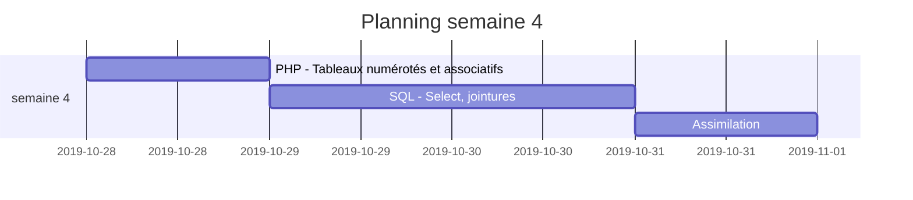
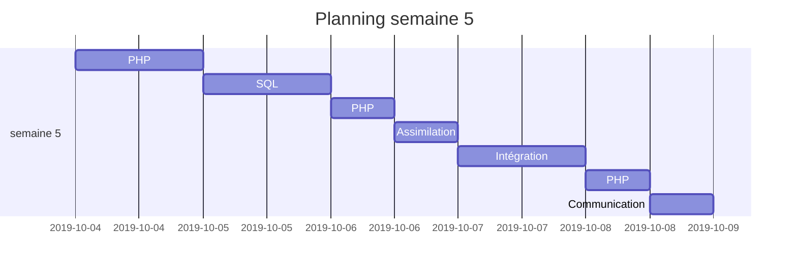

# Introduction

Formation "Développeur web et web mobile" à l'[ISFAC de Poitiers](https://www.formation-isfac.com) du 01 octobre 2019 au 12 juin 2020.

:boy: Kévin PAULMIER

## Plan des exercices

### INTEGRATION

* 01 - HTML
  * Exercice 2
  * Exercice 3 : Réalisation d'une page à partir d'une maquette visuelle.
    * Exemple
    * [Résultat](https://kevid.gitlab.io/isfac-formation-wd/integration/01-html/exercice-3/exercice-3-optimized/index.html)
* 02 -  CSS
  * Exercice 1 : Réalisation d'un mini site statique à partir d'une maquette visuelle (Le Domaine de Morton).
    * [Exemple accueil](https://kevid.gitlab.io/isfac-formation-wd/integration/02-css/exercice-1/example/accueil.png)
    * [Exemple domaine](https://kevid.gitlab.io/isfac-formation-wd/integration/02-css/exercice-1/example/domaine.png)
    * [Exemple galerie](https://kevid.gitlab.io/isfac-formation-wd/integration/02-css/exercice-1/example/galerie.png)
    * [Exemple contact](https://kevid.gitlab.io/isfac-formation-wd/integration/02-css/exercice-1/example/contact.png)
    * [Résultat](https://kevid.gitlab.io/isfac-formation-wd/integration/02-css/exercice-1/index.html)
* 03 - SASS / SCSS - Premier test sous VSCode avec compilation en temps réel (Plugin: Live Sass Compiler)
* 04 - Réalisation du site "Au coeur de Montmartre".
    * [Cahier des charges](https://kevid.gitlab.io/isfac-formation-wd/integration/04/README.md)
    * [Résultat](https://kevid.gitlab.io/isfac-formation-wd/integration/04/index.html)

### PHP

* 20 - Récupération des données d'un formulaire.
* 22 - Prise en compte des éventuels paramètres manquant après soumission du formulaire.
* 24 - Tout sur une même page. Boucle sur le formulaire jusqu'à parfaite saisie des infos demandées.
* 26 - Exercice 1 avec switch()
* 27 - Exercice 2 avec switch()
* 32 - Tableau numéroté array()
* 34 - Exercice avec un tableau numéroté
* 36 - Exercice avec un tableau associatif
* 37 - Tableaux relationnels - array()
* 38 - for()
* 41 - array() et foreach() - Exercices 1 à 3
* 43 - array() et foreach() - Exercices 4 à 9
* 47 - include() / require()
* 48 - PHP/BDD (connexion, requêtes, manipulation de résultats)
* 49 - Les cookies $_COOKIE[]
* 50 - Les sessions $_SESSION[]
* 51 - Les fonctions
* 62 - Examen partiel sur 7h
* 63 - Requêtes préparées

### SGBD

* SQL
  * 01 - Cas Facturation (exercices select)
  * 02 - Table Salariés (exercices select)
  * 03 - MACIF (exercices jointures, insert, delete, update)
  * 04 - QUAL (création de la structure d'une base de données)

## Python
* 01
* 02
* 03 - Fonctions,
* d - Modules
* e - Packages

## Communication

* 2019-11-08
  * Technique SMART
  * Les états de moi, analyse transactionnelle
  * Parlez à tous ! Suivez le guide !
* 2019-11-22
  * Gestion du stress
  * Gestion de la voix

## Planning

