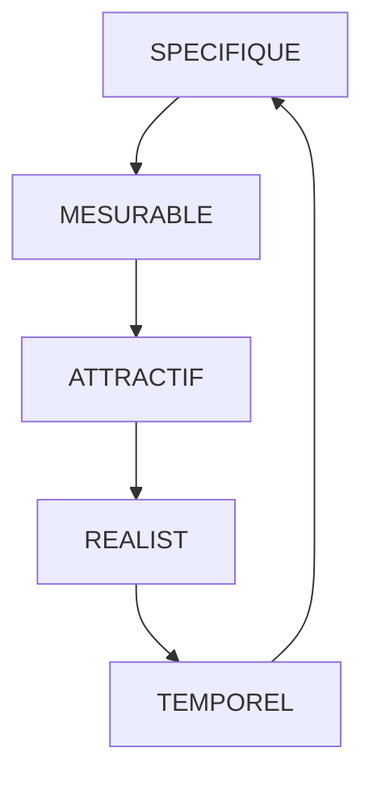

# Communication

<!-- TOC -->

- [Méthode SMART](#méthode-smart)
- [Les états de moi, analyse transactionnelle](#les-états-de-moi-analyse-transactionnelle)
- [Parlez à tous ! Suivez le guide !](#parlez-à-tous--suivez-le-guide-)
  - [Définition](#définition)
  - [Qui est concerné ?](#qui-est-concerné-)
  - [Types d’incontinence](#types-dincontinence)
  - [Comment commence l'incontinence ?](#comment-commence-lincontinence-)
  - [D'un point de vue social](#dun-point-de-vue-social)

<!-- /TOC -->

___

## Méthode SMART

- Spécifique (une seule action, personnalisée et simple)
- Mesurable (Quantité et qualité)
- Attractif (ambitieu, motivant et réaliste)
- Réaliste (attaignable)
- Temporel

Définir 2 objectifs personnels:

1. Je veux mettre en ligne mon projet croquettes.info avant l'entrée en stage 2020.

2. Être plus à l'aise à l'oral en Anglais d'ici la fin de la formation.

___

## Les états de moi, analyse transactionnelle

___

## Parlez à tous ! Suivez le guide !

Exercice de présentation d'un sujet libre en 5 min : **l'incontinance**

### Définition

L’incontinence urinaire (IU) se caractérise par « **toute perte involontaire d’urine** ».

### Qui est concerné ?

**L'incontinence touche aussi bien les hommes que les femmes** et même si la plupart du temps on entend parler de ce phénomène pour les plus de 40 ans, des jeunes femmes peuvent aussi en souffrir par exemple après un accouchement.

- 1 femme sur 3 à 70 ans
- 7 % des hommes à 65 ans (30% > 90 ans)

### Types d’incontinence

On distingue :

- L’incontinence urinaire par impériosité dite **« urgenturie »** qui survient à la suite d’ une envie pressante.
- L’incontinence urinaire **d’effort** (IUE) qui est une perte d’urinaire survenant à la suite d’un effort musculaire (rire, levée d’un poids…).
- L’incontinence urinaire **mixte** qui survient lorsque l’IUE et l’incontinence urinaire par impériosité sont associés chez un même patient ;
- L’incontinence par **regorgement** qui survient lorsqu’une vessie flasque déborde. Le sphincter laisse passer le trop plein d’urine. Comme la miction n’est plus contrôlée, on peut bien parler d’incontinence.

### Comment commence l'incontinence ?

Les principaux facteurs déclencheurs sont : **le diabète, la ménopause, l'obésité, le vieillissement, l'activité physique intense, la prise régulière de diurétique** etc., mais l'excès de boissons à base de **caféine, l'alcool, l'anxiété, les sédatifs et les médicaments tels que les antidépresseurs ou même stupéfiants** peuvent conduire à l'incontinence.

### D'un point de vue social

L'incontinence, d'un point de vue social, est un véritable tabou. Elle occasionne de la gêne pour la personne qui en est victime. Un trop grand nombre de personne ne connaît pas les causes véritables de ces troubles et auront parfois une réaction malvenue à l'encontre des personnes souffrantes. Ces personnes souffrant d'incontinence peuvent être confrontées à un mal être profond, elles auront parfois tendance à s'isoler, à perdre confiance en eux, à ne plus vouloir réaliser d'activité par peur de connaître un nouvel épisode d'incontinence...

> Sources:
> - *[https://www.mdm-france.com](https://www.mdm-france.com/incontinence-definition.html)*
> - *[http://www.maisons-de-retraite.fr](http://www.maisons-de-retraite.fr/La-sante-des-seniors/Incontinence-urinaire/L-incontinence-urinaire-chez-la-personne-agee)*
